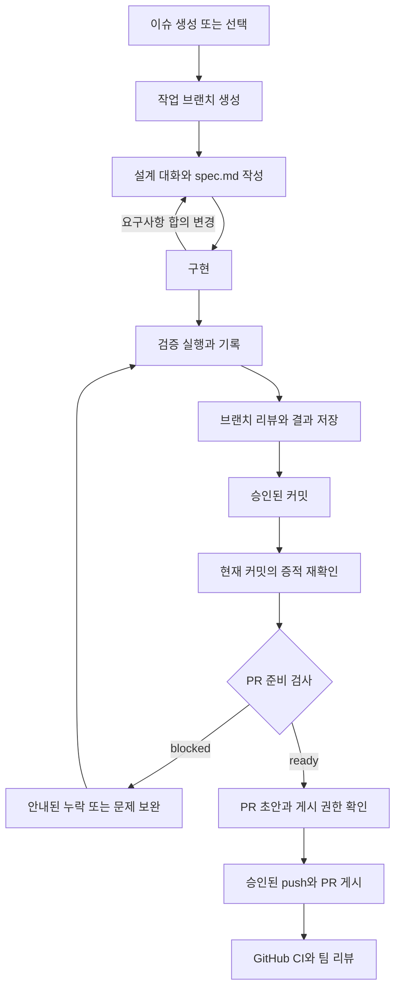

# AI 워크플로우 사용 안내

저장소 루트에서 AI에게 아래 요청을 순서대로 전달한다. 사용자는 요구사항과
설계 결정을 확인하고, 에이전트는 명세·검증·리뷰 기록을 관리한다.
세부 정책은 [공통 워크플로우](../rules/ai-workflow.md), 기록 형식은
[작업 기록](README.md)을 따른다.



## 사용자가 요청하는 순서

| 단계 | 요청 예시 | 에이전트가 하는 일 |
|---|---|---|
| 이슈 | “이 내용으로 클라이언트 이슈 만들어줘” | `create-issue`로 중복·저장소·권한을 확인하고 이슈 생성. 기존 이슈는 그대로 선택 |
| 브랜치 | “이 이슈 작업 브랜치 만들어줘” | develop 기준과 기존 변경을 확인하고 이슈 번호가 붙은 브랜치 생성 |
| 설계 | “구현 전에 설계부터 정리하자” | `logic-design`으로 완료 조건과 검증 방법을 정리해 명세 저장 |
| 구조 검토 | “이 로직의 책임과 상태 배치를 검토해줘” | 복잡한 로직은 `logic-architecture`로 단순 대안과 패턴의 필요성 검토 |
| 구현 | “합의한 설계대로 구현해줘” | 승인된 범위 구현. 합의 변경은 메인 에이전트가 명세에 반영 |
| 검증·리뷰 | “검증하고 리뷰해줘” | 실제 명령 실행·기록, 전체 변경 수집, 기본 기준과 추가 관점으로 리뷰 |
| 커밋 | “이번 작업 커밋해줘” | 변경을 확인한 뒤 승인된 커밋. 커밋 후 이전 증적을 재확인 |
| PR | “준비 상태를 확인하고 PR 올려줘” | 준비 검사와 제목·본문을 먼저 준비하고 구체적인 게시 권한에 따라 push·PR 생성 |
| 작업 재개 | “이 이슈 작업 이어서 진행해줘” | `workflow:resume`과 명세를 읽고 오래된 결과·다음 작업을 확인 |

스킬명을 매번 입력할 필요는 없다. 에이전트가 `AGENTS.md`의 라우팅을 적용한다.
최초 설계 이후에는 `logic-design`을 다시 실행하지 않아도 합의한 요구사항·설계
변경을 메인 에이전트가 명세에 반영한다. 개념 질문이나 미확정 제안은 합의로 저장하지 않는다.
파일을 감시하는 별도 프로그램은 없으므로 실행 결과와 문서 변경은 보고에서 확인한다.

## 저장되는 파일

```text
docs/ai-workflow/tasks/{번호}/spec.md         공유하는 요구사항·설계·완료 조건
.tmp/ai-workflow/tasks/{번호}/status.json    이 checkout의 진행·검증·리뷰 기록
.tmp/ai-workflow/tasks/{번호}/checks/        실제 검사 로그와 대상 정보
.tmp/ai-workflow/tasks/{번호}/reviews/       리뷰 세션의 patch·입력·결과
```

명세는 Git으로 공유한다. `.tmp`는 Git에서 제외되어 다른 컴퓨터나 새 clone으로
전달되지 않는다. 같은 checkout에서는 대화를 새로 열어도 파일이 남아 있는 동안
기록을 복원할 수 있다. `.tmp`를 삭제하면 명세는 남지만 로컬 증적은 다시 만들어야 한다.
서브에이전트는 맡은 구현·제안·근거를 반환하고 메인 에이전트가 공유 명세와 상태를 통합한다.
위임 여부와 모델 선택은 사용자 승인에 따른다.

## 에이전트가 실행하는 명령

아래 예시는 이슈 114와 로컬 비교 기준 `origin/develop`을 사용한다.
다른 작업에서는 실제 번호와 존재하는 기준 ref로 바꾼다. 로컬 ref의 원격 최신
여부는 별도 확인하며 없는 기준을 임의로 대체하지 않는다.

```bash
# 읽기 전용: 새 대화에서 작업 복원
pnpm workflow:resume --issue 114 --base origin/develop

# 읽기 전용: 공유 지침·스킬·명령·템플릿·CI 구조 확인
pnpm workflow:harness-check

# 실제 실행 + 로컬 기록: 모든 PR의 공통 검사
pnpm workflow:check --issue 114 --base origin/develop --script workflow:harness-check

# 하네스 코드 변경 시
pnpm workflow:check --issue 114 --base origin/develop --script workflow:test

# 앱·의존성·빌드 설정 변경 시
pnpm workflow:check --issue 114 --base origin/develop --script lint
pnpm workflow:check --issue 114 --base origin/develop --script check-types
pnpm workflow:check --issue 114 --base origin/develop --script build

# 리뷰 전에 시작하고 실제 검토 후 input.json을 채워 저장
pnpm workflow:review --issue 114 --base origin/develop --start
pnpm workflow:review --issue 114 --base origin/develop --input .tmp/ai-workflow/tasks/114/reviews/{세션}/input.json

# 읽기 전용: 게시 전에 현재 증적 확인
pnpm workflow:pr-check --issue 114 --base origin/develop --json
```

검사 기록 명령은 한 번에 하나씩 실행한다. 문서 전용 작업은 공통 하네스 검사와
문서 검토를 수행하고 앱 검사에는 N/A 이유를 남긴다. `docs-review`, N/A, 완료
조건의 충족 근거와 추가 동작 관측은 에이전트가 실제 검토 후
[수동 판단 형식](README.md#수동-판단-기록)으로 기록한다. 리뷰 시작이나 검사의
성공만으로 완료 조건이 자동 충족되지는 않는다.

## blocked가 나오면

| 표시된 이유 | 다음 행동 |
|---|---|
| 로컬 상태 없음 | 명세와 실제 변경을 읽고 적용되는 검증·리뷰를 새로 수행 |
| `needs-recheck` / `unknown` | 대상 코드·명세·환경을 확인하고 필요한 검사·판단·리뷰 갱신 |
| 미커밋 변경 | 내용을 검토하고 승인된 커밋 절차 진행. 자동 커밋하지 않음 |
| 최신 검사 실패 또는 로그 없음 | 원인을 해결한 뒤 실제 명령을 다시 실행·기록 |
| AC 근거 없음 | 완료 조건별 동작을 확인하고 근거 파일·현재 subject 기록 |
| 미해결 리뷰 결함 | 수정하고 관련 검증과 리뷰를 다시 수행. 이전 지적을 삭제하지 않음 |
| 리뷰 미확인 범위 | 완료 조건에 미치는 영향을 확인하고 추가 검증 또는 근거 있는 판단 기록 |
| 하네스 설정 오류 | 출력된 파일·원인·조치를 확인하고 공유 구조 복구 |

`passed`는 검사 성공, `current`는 현재 대상과의 일치, `ready`는 기술적 게시 준비다.
각각 다른 의미이며 `ready`가 push·PR·머지 권한을 주지는 않는다.
커밋하면 HEAD와 index 지문이 달라져 이전 기록이 오래된 것으로 표시될 수 있다.
현재 대상에 대한 재실행 또는 근거 있는 재확인 기록을 남기며 오래된 subject를
그대로 두고 freshness만 바꾸지 않는다.

## 로컬 검증과 CI

CI는 설치 → 하네스 검사 → workflow 테스트 → lint → 타입 검사 → build를 실행한다.
로컬 `.tmp` 기록에 의존하는 `workflow:check`와 `workflow:pr-check`는 CI에서
실행하지 않는다. 공유 구조 검사는 자연어 정책의 의미나 실제 기능을 자동 판정하지 않는다.
로컬 통과, 실제 GitHub CI 결과, 팀 리뷰는 각각 확인한다. `pnpm workflow:test`에는
임시 Git 저장소의 실제 명령을 연결한 통합 흐름도 포함되며 원격 이슈·PR는 생성하지 않는다.
